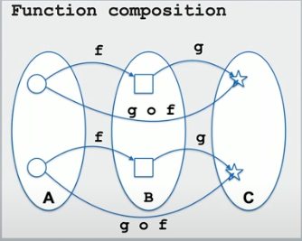

# Functional Programming. Use Case One Exercise.

After listening to [No Nonsense Monad & Functor - The foundation of Functional Programming](https://www.youtube.com/watch?v=e6tWJD5q8uw)
(by César Tron-Lozai),

I decided to give myself the task of java coding the presented use case:

Given a `String` like `"12.2/2"`, return the `double` = `12.2/2 = 6.1`

resulting in:

1. OO java like (see file `UseCaseOne.java`
2. Functional like (see file `LambdaUseCaseOne.java`
4. Compare tests. (see files `UseCaseOneTest` & `LambdaUseCaseOneTest`

Here, a summary of Mr. Tron's presentation. 

## Definitions

### Function Types.


`f :: A -> B`  or in Java: `public B f (A p)`

examples

* `parseInt :: String -> int` (Haskell like). 
* `public int parseInt (String i)` (Java like).
* `Add :: int -> int -> int`. Or
* `public int add (int x, int y)`

### Function Composition.



* f :: A -> B
* g :: B -> C
* g `o` f :: A -> C
* `o` :: (A->B) -> (B->C) -> (A->C)


g `o` f =se lee como= g `after` f


in java

* g `compose` f = g `o` f 
* g `andThen` f = f `o` g 

### Higher Order Function

A function that either
* has a function as a parameter
* returns a function


## Pure Functional Programming

A program that with `pure` functions only.

`pure` function is a function with no side effects.

`Declarative`: you indicate `what` to do, not `how` to do it.

## Functor

If you have a type, `blue`, a `functor` will give you another type `blue-box`. (see diagram).

If you have a function `g` from `blue` to `yellow` a `functor` will give you another function from `blue-box` to `yellow-box`.


### Functor Definition

* A `functor` is a container for `types`.
* A `functor` creates `map(g)` from `g`. (Aka `map` "lifts" `functions`).
* `Lifted functions` change `context of the box`, not the box itself.
* `Structure` is `unchanged`.

Functor examples: `Optional` and `List`.


Una cosa interesante que dice este pibe es:

Knowing nothing about `blue`, force us to better programming.

Knowing nothing, force us to the little diagram.

If instead of `blue` we would have `String`, we could have written:

```
public String appendA (String s) {
    if (null == s)
        return "A" ;
    return (s + "A") ;
}
```

and `functor` is gone.

Para el caso de la `List`, el `functor` cambia contenido, preservando estructura.

### Functor Cheat-Sheet

`functor` = `map`

## Monad

* a `functor`
* that `flattens`


Fish operator `>=>` is the infix operator of `flat-map`


### Monad Cheat-Sheet

`monad` = `flat-map`


and in Java,  `monad` = `andThen`


The brown arrow code, using "embellished types" is 


which increases management of exceptions, losing composition.

`Monads`, *puts the cherry on top*, by making it composable too !.


## Code

See under `src`.
